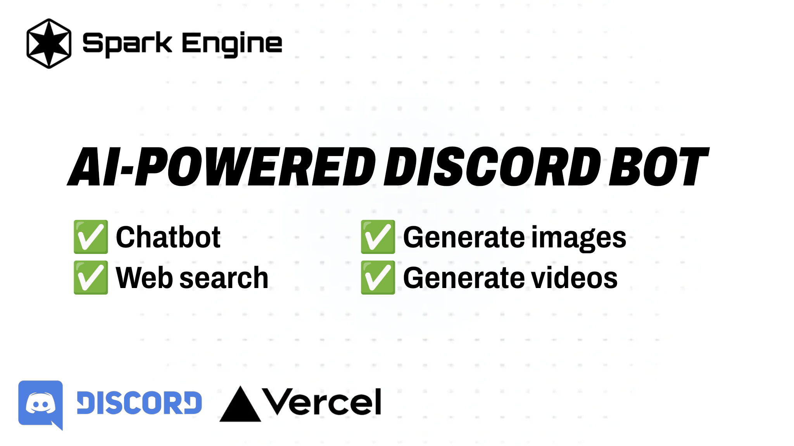
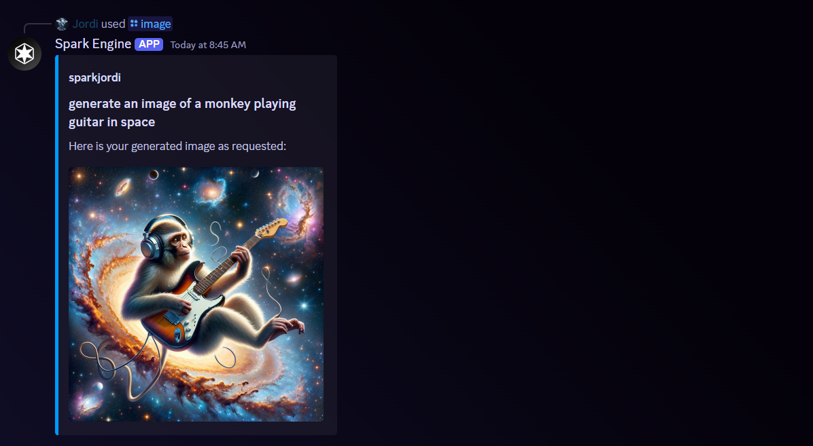
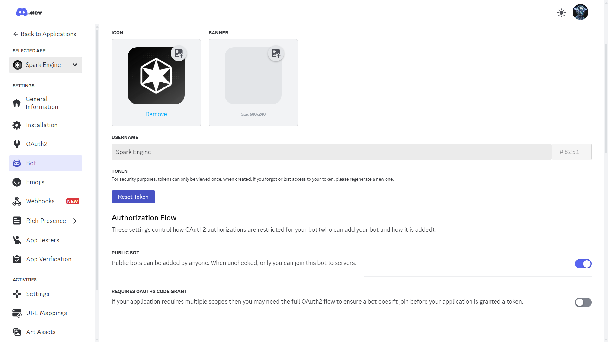
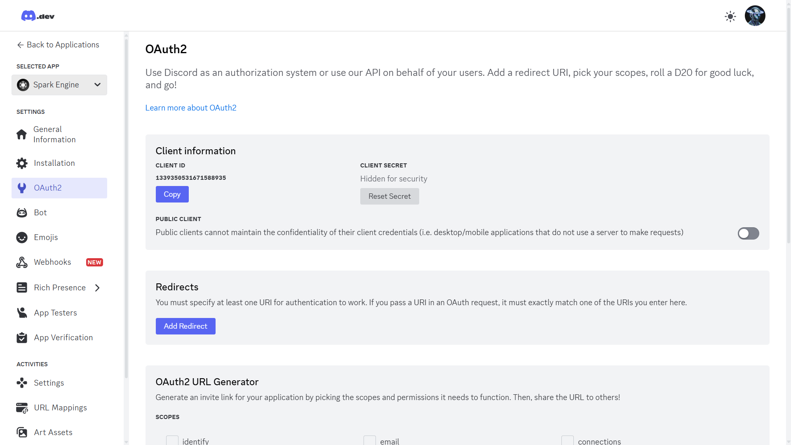
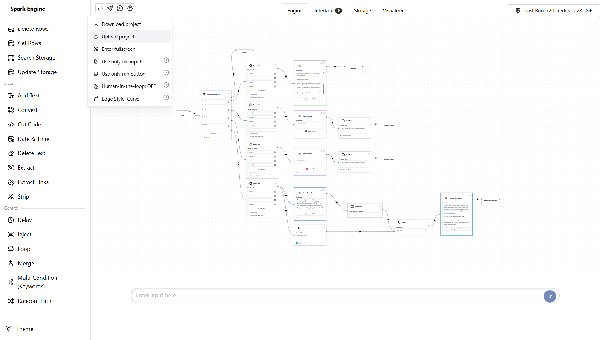

# **Spark Engine Discord Bot**  

  

An AI-powered chatbot for Discord using **Spark Engine** to handle chat, search, image generation, and video assistance. Uses Llama3.3, DALL-E, Minimax Video-01 and Spark Engine to create the ultimate AI Discord bot for your servers.

[](https://github.com/spark-engine-ai)  
[](https://discord.gg/VAQA5c32jM)  

---

## **Features**  
✅ **AI-Powered Chat** – Have dynamic conversations with Spark Engine  
🔍 **Web Search** – Fetch real-time search results  
🎨 **Image Generation** – Create AI-generated images  
📽️ **Video Generation** – Create AI-generated videos 
⚡ **Easy Deployment** – Run locally, with Docker, or host on your own server/hosting provider  

---

  

  

## **Getting Started**  

### **Step 1: Create a Discord Bot**  
1. Go to the [Discord Developer Portal](https://discord.com/developers/applications)  
2. Click **"New Application"**, name your bot, and go to the **Bot** tab  
3. Click **"Add Bot"** → Copy your **Bot Token** (add it to `DISCORD_BOT_TOKEN` in your `.env`)  
     
4. Under **OAuth2 → Copy Client ID** (add it to `DISCORD_CLIENT_ID` in your `.env`)  
     
5. Select the `bot` tab, and under `Privledged Gateway Intents` toggle on `Message Content Intent`
6. Scroll down to `applications.commands`, then choose permissions (e.g., Send Messages, Read Messages, etc.)  
7. Go to [Spark Engine](https://sparkengine.ai) and create an account
8. Create a new project on Spark Engine and upload the `ai-discord-bot.spk` file found at the root of this project  
     
9. Copy your **Project ID** by clicking the **"API"** button inside your project menu on Spark Engine (add it to `PROJECT_ID` in your `.env`). This will be the AI flow that your bot calls, and you can modify it as needed.  
10. Go to [Your API Keys](https://sparkengine.ai/account/api-keys) and add it to `SPARK_ENGINE_API_KEY` in your `.env`.  
11. Once you’ve deployed and run the bot (see below), invite it to your Discord server!  

---

## **Installation Options**  

### **1️⃣ Local Setup**  

#### **Install Node.js**  
Download & install **Node.js (v16 or higher)** from [nodejs.org](https://nodejs.org/).  

#### **Clone the Repository**  
```bash
git clone https://github.com/YOUR-REPO/Spark-Engine-Discord-Bot.git
cd Spark-Engine-Discord-Bot
```

#### **Install Dependencies**  
```bash
npm install
```

#### **Set Up Environment Variables**  
Rename `.env.example` to `.env` and fill in the following values:  
```env
DISCORD_BOT_TOKEN=your-bot-token
DISCORD_CLIENT_ID=your-client-id
SPARK_ENGINE_API_KEY=your-api-key
PROJECT_ID=your-spark-engine-project-id
DASHBOARD_USERNAME=admin
DASHBOARD_PASSWORD=admin
```

#### **Run the Bot Locally**  
```bash
npm run start
```

The bot should now be running! ✅  

Open [http://localhost:8080](http://localhost:8080) in your browser and enter your `DASHBOARD_USERNAME` and `DASHBOARD_PASSWORD`. (Defaults are both “admin”.)

---

### **2️⃣ Docker Setup**  

#### **Build the Docker Image**  
```bash
docker build -t discordsparkengine .
```

#### **Run the Docker Container**  
```bash
docker run -p 8080:8080 -v discordsparkengineconfig:/discordsparkengine/configFile discordsparkengine
```

---

### **3️⃣ Other Deployment Options**  

To keep your bot running 24/7, you’ll need a hosting provider or server that supports a persistent Node.js process. Some popular options include:

- **Railway.app**  
- **Fly.io**  
- **Render.com**  
- **Heroku**  
- **AWS EC2** (or other VPS providers)  

After setting up your environment variables on your hosting platform, simply run:
```bash
npm run start
```
Or use a process manager like **PM2** for production:
```bash
npm install pm2 -g
pm2 start index.js
```

---

## **Commands**  

| Command   | Description                  |
|-----------|------------------------------|
| `/chat`   | General AI chat              |
| `/search` | Perform a web search         |
| `/image`  | Generate an AI-powered image |
| `/video`  | Generate an AI-powered video |

---

## **License**  
This project is licensed under the **MIT License**.  

---

Now you’re ready to launch your **Spark Engine Discord Bot**! 🚀
